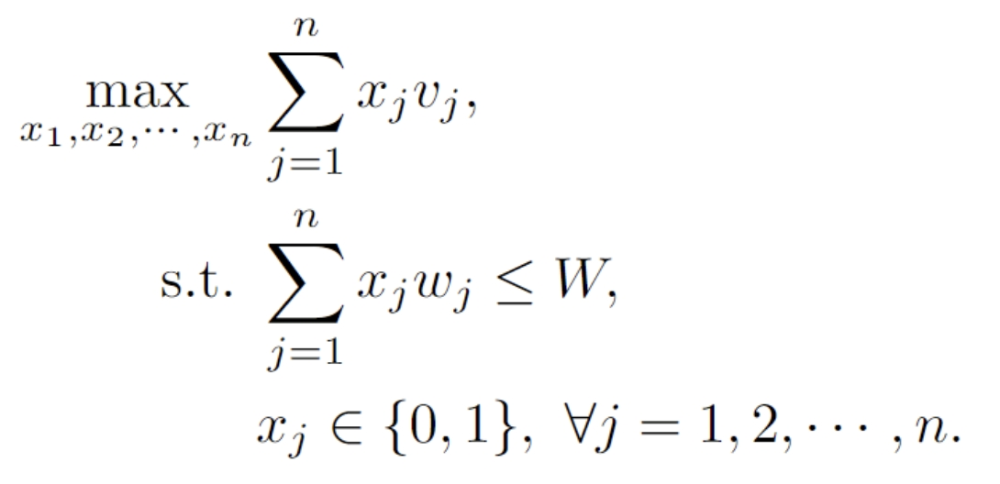
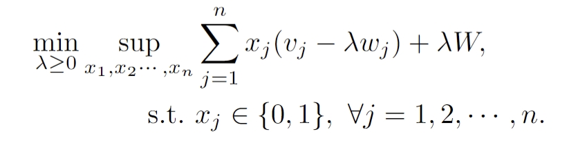
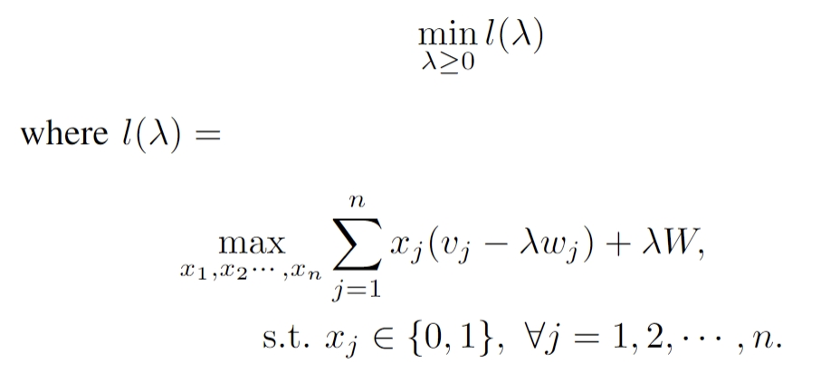
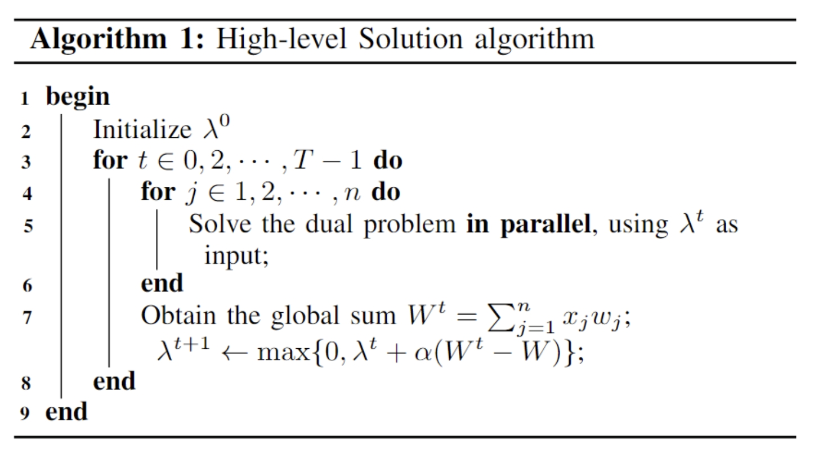
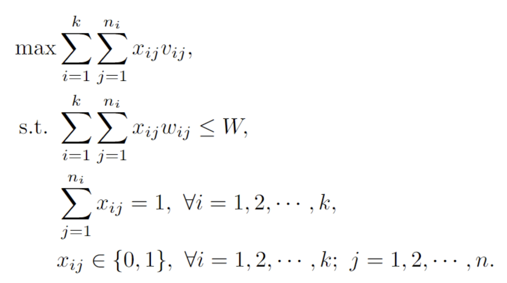
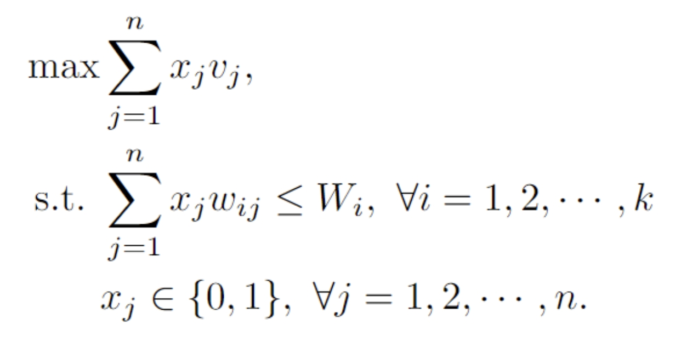

# CSCI596-Final-Project

## Problem Description

The knapsack problem is a well-known problem described as follows:

**Input**: a set of $n$ items with weights $w_1, w_2, \cdots, w_n$ and values $v_1, v_2, \cdots, v_n$; the space limit $W$

**Output**: a subset of items. Denote $x_j = 1$ if the $j$-th item is chosen; otherwise, $x_j = 0$.

**Constraint**: the total weight of chosen items is less than or equal to the space limit, that is, $\sum_{j} x_j w_j \leq W$.

**Objective**: maximize the total value of chosen items, that is, maximize $\sum_{j} x_j v_j$.

In this project, I plan to solve the large-scale knapsack problem. That is, $n$ is very large.

## Challenges

The knapsack problem 

is known as NP-hard. Some existing algorithms include:

* Dynamic programming - Exact algorithm, pseudo-polynomial time $O(nW)$

* Branch-and-bound - Exact algorithm, exponential time $O(2^n)$

* Greedy algorithm - Approximate algorithm, require sorting, $O(n \log n)$

When $n$ is very large, the above algorithms result in long running times and some new algorithms need to be developed. A desired algorithm should satisfy:

- The time complexity is $O(n)$
- The algorithm can be run in parallel

## Methods

To develop a desired algorithm, we formulate the Lagrangian dual problem as follows:

Or

Interestingly, this Lagrangian dual problem has a separable structure, which allows us to develop our desired algorithm. 

So the high-level idea of our algorithm is:

- STEP 1: Initialize a value of $\lambda$
- STEP 2: Given $\lambda$, solve the inner maximization problem which can be done **in parallel** and in $O(n)$
- STEP 3: Update the value of $\lambda$ according to the dual ascent method
- Repeat STEP 2 and STEP 3 until converge

## Extensions

The original knapsack problem can be generalized into many variants. For example, the **Multiple-Choice Knapsack Problem (MCKP)**, where items are categorized into $k$ different classes and only one item can be chose for each class:

And the **Multi-Dimensional Knapsack Problem (MDKP)**, where there is more than one constraint:

For these variants, simple algorithms like the greedy algorithm might not work, but our Lagrangian-dual algorithm can be still applied and parallel computing is still possible!

## Expected Results

- Implement the Lagrangian-dual algorithm using various parallel computing techniques, including MPI and OpenMP
- Compare the timing results among different parallel computing techniques
- Show the advantage of the parallel Lagrangian-dual algorithm over the greedy algorithm, in terms of running time
- Solve the extensions of the knapsack problem, like MCKPs and MDKPs.
