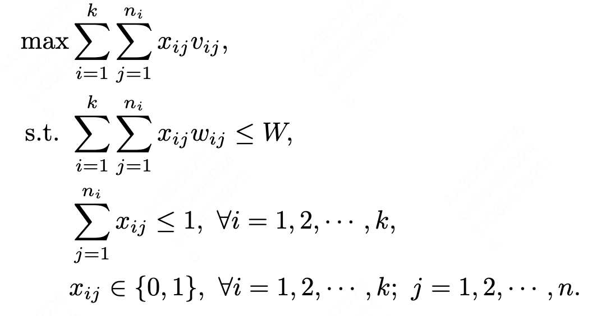

# CSCI596-Final-Project: Solving Large-Scale Knapsack Problem via Lagrangian-Dual-Based Parallel Algorithms

## Problem Description

The knapsack problem is a well-known problem described as follows:

**Input**: a set of $n$ items with weights $w_1, w_2, \cdots, w_n$ and values $v_1, v_2, \cdots, v_n$; the space limit $W$.

**Output**: a subset of items. If the $j$-th item is chosen, let $x_j = 1$; otherwise, $x_j = 0$.

**Constraint**: the total weight of chosen items is less than or equal to the space limit, that is, $\sum_{j} x_j w_j \leq W$.

**Objective**: maximize the total value of chosen items, that is, maximize $\sum_{j} x_j v_j$.

In this project, I solve the large-scale knapsack problem. That is, $n$ is very large (e.g., larger than 1,000,000).

## Challenges

The knapsack problem 

is known as NP-hard. Some existing algorithms include:

* Dynamic programming - Exact algorithm, pseudo-polynomial time $O(nW)$. Note that this dynamic programming approach can only be applied when all parameters are interger, which is not suitable for some cases.

* Branch-and-bound - Exact algorithm, exponential time $O(2^n)$. This method can obtain the optimal result, but it is extremely slow.

* Greedy algorithm without sorting - Approximate algorithm, just put the items one by one until the space is full. The time complexity is $O(n)$. This method is very fast, but the total values obtained are not satisfactory.

* Greedy algorithm with sorting - Approximate algorithm, firstly sort the items according to their ratios of values to weights, then greedly choose the items with higher ratios. The time complexity is $O(n \log n)$. This method seems satisfactory for large-scale problem, but we will show that it is still very slow when $n$ is more than 1 million.

In summary, when $n$ is very large, the above algorithms have a bad performance. Some new algorithms need to be developed. A desired algorithm should satisfy:

- The total values obtained should be satisfactory (should not be too far from the optimal maximum value).
- The time complexity should be close to $O(n)$. It is even better if the algorithm can be run in parallel.

## Methods

To develop a desired algorithm, we formulate the Lagrangian dual problem as follows:

Or

Interestingly, this Lagrangian dual problem has a separable structure, which allows us to develop our desired algorithm. The high-level idea of our algorithm is:

- STEP 1: Initialize a value of $\lambda$
- STEP 2: Given $\lambda$, solve the inner maximization problem which can be done in $O(n)$
- STEP 3: Update the value of $\lambda$ according to the dual ascent method
- Repeat STEP 2 and STEP 3 until converge
- After obtaining the final value of $\lambda$, repeat STEP 2 again and obtain the final feasible solution to the original knapsack problem

The detailed pseudo-code is written as follows:

From the pseudo-code, we can see that Lines 7 to 11 can be done in parallel, so parallel computing techniques can be applied.

## Implementation and Experiment Results

In the experiment section, we have the following settings:
- The number of items $n = 1,000,000, 10,000,000$ or $100,000,000$;
- The weight and value of each item are randomly generated, taking values between 0 and 1;
- The space limit $W = 0.1n$;
- For each part of experiment, we try 3 different random seeds and report the average results of 3 repeated experiments.

### Comparison of Greedy Algorithms and Our Algorithm

Firstly, we compare the greedy algorithm (with/without sorting) and our Lagrangian-dual algorithm. Here the Lagrangian-dual algorithm has not been parallelized yet.

### Parallel Algorithm via MPI

For this part

## Extensions

For the following variants, simple algorithms like the greedy algorithm might not work, but our Lagrangian-dual algorithm can be still applied and parallel computing is still possible.

### Multiple-Choice Knapsack Problem (MCKP)
 
The original knapsack problem can be generalized into many variants. For example, the **Multiple-Choice Knapsack Problem (MCKP)**, where items are categorized into $k$ different classes and only one item can be chose for each class:

### Multi-Dimensional Knapsack Problem (MDKP)

And the **Multi-Dimensional Knapsack Problem (MDKP)**, where there is more than one constraint:

## Conclusion and Future Works

- Implement the Lagrangian-dual algorithm using various parallel computing techniques, including MPI and OpenMP
- Compare the timing results among different parallel computing techniques
- Show the advantage of the parallel Lagrangian-dual algorithm over the greedy algorithm, in terms of running time
- Solve the extensions of the knapsack problem, like MCKPs and MDKPs.

## Reference

Zhang, X., Qi, F., Hua, Z., & Yang, S. (2020, April). Solving billion-scale knapsack problems. In Proceedings of The Web Conference 2020 (pp. 3105-3111).
