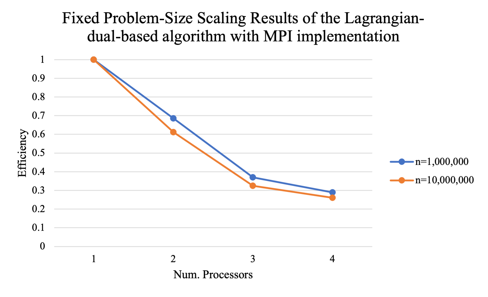

# CSCI596-Final-Project: Solving Large-Scale Knapsack Problem via Lagrangian-Dual-Based Parallel Algorithms

## Problem Description

The knapsack problem is a well-known problem described as follows:

**Inputs**: a set of $n$ items with weights $w_1, w_2, \cdots, w_n$ and values $v_1, v_2, \cdots, v_n$; the space limit $W$.

**Outputs**: a subset of items. If the $j$-th item is chosen, let $x_j = 1$; otherwise, $x_j = 0$.

**Constraint**: the total weight of chosen items is less than or equal to the space limit, that is, $\sum_{j} x_j w_j \leq W$.

**Objective**: maximize the total value of chosen items, that is, maximize $\sum_{j} x_j v_j$.

In this project, I solve the large-scale knapsack problem. That is, $n$ is very large (e.g., larger than 1,000,000).

## Challenges

The knapsack problem 

is known as NP-hard. Some existing algorithms include:

* **Dynamic programming** - Exact algorithm, pseudo-polynomial time $O(nW)$. Note that this dynamic programming approach can only be applied when all parameters are integer, which is not suitable for some cases.

* **Branch-and-bound** - Exact algorithm, exponential time $O(2^n)$. This method can obtain the optimal result, but it is extremely slow.

* **Greedy algorithm without sorting** - Approximate algorithm, just put the items one by one until the space is full. The time complexity is $O(n)$. This method is very fast, but the total values obtained are not satisfactory.

* **Greedy algorithm with sorting** - Approximate algorithm, firstly sort the items according to their ratios of values to weights, then greedily choose the items with higher ratios. The time complexity is $O(n \log n)$. This method seems satisfactory for large-scale problems, but I will show that it is still very slow when $n$ is more than 1 million.

In summary, when $n$ is very large, the above algorithms have a bad performance. Some new algorithms need to be developed. A desired algorithm should satisfy:

- The total values obtained should be satisfactory (should not be too far from the optimal maximum value).
- The time complexity should be close to $O(n)$. It is even better if the algorithm can be run in parallel.

## Methods

To develop a desired algorithm, I formulate the Lagrangian dual problem as follows:

Or

Interestingly, this Lagrangian dual problem has a separable structure, which allows me to develop the desired algorithm. The high-level idea of my algorithm is:

- STEP 1: Initialize a value of $\lambda$
- STEP 2: Given $\lambda$, solve the inner maximization problem which can be done in $O(n)$
- STEP 3: Update the value of $\lambda$ according to the dual ascent method
- Repeat STEP 2 and STEP 3 until converge
- After obtaining the final value of $\lambda$, repeat STEP 2 and obtain the final feasible solution to the original knapsack problem

The detailed pseudo-code is written as follows:

From the pseudo-code, we can see that Lines 7 to 11 can be done in parallel, so parallel computing techniques can be applied.

## Implementation and Experiment Results

In the experiment section, I have the following settings:
- I tried three different numbers of items, 1 million, 10 million, and 100 million;
- The weight and value of each item are randomly generated, taking values between 0 and 1. I try 3 different random seeds and report the average results of 3 repeated experiments;
- The space limit $W = 0.1n$;
- For Lagrangian-dual-based algorithm, I set $\alpha = \varepsilon = 0.0001$, and $T = 100$.

### Comparison of Greedy Algorithms and Lagrangian-Dual-Based Algorithm

Firstly, I compare the greedy algorithm (with/without sorting) and my Lagrangian-dual-based algorithm. Here the Lagrangian-dual-based algorithm has not been parallelized yet.

The codes are implemented in `knapsack_greedy_sorting.c`, `knapsack_greedy_nonsorting.c`, and `knapsack_lagrangian.c`. And `knapsack_baseline.sl` is the batch file that can reproduce my results (`results/knapsack_baseline.out`).

The following table shows the total values obtained by different algorithms. Results show that the greedy algorithm without sorting cannot produce a good solution, and my algorithm produces a similar solution to the greedy algorithm with the sorting process.

|                 | Greedy (without sorting) | Greedy (with sorting) | Lagrangian-dual-based |
|-----------------|--------------------------|-----------------------|-----------------------|
| n = 1,000,000   | 100037.87 ± 186.28       | 257499.12 ± 237.18    | 257363.51 ± 313.46    |
| n = 10,000,000  | 999642.28 ± 692.23       | 2576426.51 ± 341.62   | 2575599.66 ± 572.32   |
| n = 100,000,000 | 9999590.06 ± 1943.42     | Memory exceeded       | 25755056.01 ± 1656.31 |

The following table shows the running times of different algorithms (in seconds). The greedy algorithm without sorting is indeed very quick, while the greedy algorithm with sorting is relatively slow and cannot run when $n$ is 100 million. My algorithm can be run in a reasonable time.

|                 | Greedy (without sorting) | Greedy (with sorting) | Lagrangian-dual-based |
|-----------------|--------------------------|-----------------------|-----------------------|
| n = 1,000,000   | 0.003 ± 0.006            | 0.760 ± 0             | 0.723 ± 0.006         |
| n = 10,000,000  | 0.030 ± 0                | 70.093 ± 0.475        | 6.313 ± 0.549         |
| n = 100,000,000 | 0.493 ± 0.006            | Memory exceeded       | 46.370 ± 0.111        |

In summary, I have shown the advantage of my Lagrangian-dual-based algorithm, compared to the baseline greedy algorithms.

### Parallel Algorithm via MPI

For this part, I parallelize my Lagrangian-dual-based using MPI programming. The codes are implemented in `knapsack_mpi.c`. And `knapsack_mpi.sl` is the batch file that can reproduce my results. When submitting the batch job, I let the number of nodes be 2, and let the number of tasks per node be 4.

The following table shows the running times (in seconds) of my Lagrangian-dual-based algorithm via MPI, under a different number of processes (`results/knapsack_mpi_v1.out`). The results show that it is beneficial to use MPI to parallelize the algorithm. However, it is strange that when the number of processes is 8, the running time will be slightly larger than when the number of processes is 4. The possible reason is the interference of different jobs and nodes.

|                 | Num. Processes = 1 | Num. Processes = 2 | Num. Processes = 4 | Num. Processes = 8 |
|-----------------|--------------------|--------------------|--------------------|--------------------|
| n = 1,000,000   | 0.84 ± 0           | 0.47 ± 0.01        | 0.29 ± 0.01        | 0.29 ± 0.01        |
| n = 10,000,000  | 5.67 ± 0.11        | 3.18 ± 0.04        | 2.12 ± 0.04        | 2.14 ± 0.02        |
| n = 100,000,000 | 41.59 ± 0.04       | 24.93 ± 0.03       | 19.63 ± 0.32       | 21.24 ± 0.44       |

And the timing results are plotted as follows:

The fixed problem-size efficiency is plotted as follows:

When I submitted the batch job again, two adjacent nodes were allocated this time, and the tendency became normal (`results/knapsack_mpi_v2.out`).

|                 | Num. Processes = 1 | Num. Processes = 2 | Num. Processes = 4 | Num. Processes = 8 |
|-----------------|--------------------|--------------------|--------------------|--------------------|
| n = 1,000,000   | 0.89 ± 0.01        | 0.48 ± 0           | 0.30 ± 0           | 0.35 ± 0.01        |
| n = 10,000,000  | 6.79 ± 0.02        | 3.72 ± 0.01        | 2.59 ± 0.01        | 2.23 ± 0.03        |
| n = 100,000,000 | 46.66 ± 1.98       | 29.52 ± 0.46       | 24.20 ± 0.35       | 22.39 ± 0.08       |

## Extensions

For the variants of the knapsack problem, simple algorithms like the greedy algorithm might not work, but the Lagrangian-dual-based algorithm can still be applied and parallel computing is still possible. For example, the **Multiple-Choice Knapsack Problem (MCKP)**, where items are categorized into $k$ different classes and only one item can be chosen for each class:

When $k$ is very large (i.e., $k>>n$), the MCKP problem can be also solved using MPI. I let $k$ be 1 million and 10 million, and let all values of $n$ be 2. The codes are in `MCKP_mpi.c` and the batch file is `MCKP_mpi.sl`. The running time results are (in seconds):

|                 | Num. Processes = 1 | Num. Processes = 2 | Num. Processes = 4 | Num. Processes = 8 |
|-----------------|--------------------|--------------------|--------------------|--------------------|
| n = 1,000,000   | 2.94 ± 0.12        | 2.15 ± 0.10        | 1.99 ± 0.10        | 1.27 ± 0.06        |
| n = 10,000,000  | 26.06 ± 1.41       | 21.30 ± 0.91       | 20.07 ± 0.68       | 12.50 ± 0.17       |

Also, the fixed problem-size efficiency is plotted as follows:

## Conclusion and Future Works

- In this project, I implemented the Lagrangian-dual-based algorithm to solve large-scale knapsack problems, which has an advantage in terms of both running time and solution quality.
- I parallelize the Lagrangian-dual-based algorithm using MPI. Results show that the parallelization can effectively reduce the running time.
- I also solve an extension of the knapsack problem, the Multiple-Choice Knapsack Problem (MCKP).

For this project, some possible future works include:

- Fine-tune the MPI implementation and further reduce the running time.
- Investigate the OpenMP implementation as well as the MPI+OpenMP implementation. Actually, I have tried to implement these two techniques (see `unused/knapsack_openmp.c` and `unused/knapsack_hybrid.c`), but the results did not show any improvement, probably due to the high communication time among threads. It is interesting to further optimize the OpenMP code and increase the efficiency.

## Reference

The high-level idea of this project comes from the following paper:

Zhang, X., Qi, F., Hua, Z., & Yang, S. (2020, April). Solving billion-scale knapsack problems. In Proceedings of The Web Conference 2020 (pp. 3105-3111).
